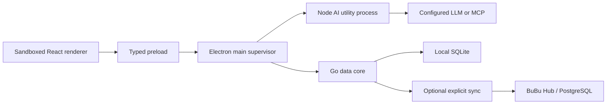

# BuBu

BuBu is a local-first AI data workspace for conversational Excel and CSV analysis. It imports data into a local analytical database, lets deterministic code profile and query it, and gives models only the schema, locally generated synthetic examples, or explicitly approved aggregates by default.

The product interaction treats a dataset as a contact and a dataset group as a group chat. Users can ask questions, validate formats, join files, create charts and reports, replace recurring data, and save repeatable work as workflows.

## Current status

The repository is migrating from the historical Wails prototype to a hardened Electron product:

- Implemented: Electron 43 secure shell, sandboxed React renderer, typed preload API, supervised Node AI utility process, Go data-core sidecar, authenticated versioned RPC, packaging, and packaged smoke verification.
- Implemented: atomic CSV/TSV/XLSX batch import, local SQLite catalog, immutable replacement versions, schema-drift blocking and interactive one-to-one column mapping, bounded previews, type inference, and baseline column profiles.
- Implemented: schema-only/synthetic model context, a local provider registry, OS-encrypted write-only credentials, active-model selection, connection tests, and bounded OpenAI, Anthropic, Gemini, compatible, and Ollama adapters.
- Implemented: single-dataset natural-language planning with an exact disclosure preview, explicit user approval, a no-raw-SQL typed plan, and bounded local execution in Go.
- Implemented: local data groups with 2–8 current dataset contacts, create/edit/delete UI, stable member order, and no raw-data copying.
- Implemented: natural-language group lookup/join plans, connected-tree enforcement, unique right-side lookup keys, disclosure review, explicit approval, and bounded local multi-table execution.
- Implemented: deterministic local bar/time-series visualizations for numeric query results, with no result round-trip to a model and a 20-point readability bound.
- Implemented: append-only local dataset/group conversation history for typed questions, disclosure-bound plans, bounded results, and errors, restored after restart.
- Implemented: local quality scoring and profiles plus persistent required/unique/range/pattern/allowed-value rules, with only bounded failure row numbers shown.
- Implemented: deterministic same-name relationship discovery, manually defined directional lookup relations, current-version validity checks, and schema-only model hints.
- Implemented: native-path-private streaming CSV export with UTF-8/Excel formula hardening, plus confirmed permanent deletion of all versions and dependent local state with automatic group repair.
- Implemented: path-private consistent local data backups and destructive restore with strict container/hash/schema/privacy validation, rollback, and interrupted-swap startup recovery.
- Implemented: on-demand local-only column exploration with 10-bin numeric histograms, means/ranges, and bounded categorical Top values that never enter model context.
- Implemented: named cancellation for imports, replacements, exports, backup/restore, local scans, model planning, and single/group queries, propagated through authenticated RPC into Go contexts and provider fetch signals.
- Implemented: an executable 100 MiB/183,246-row reference-device gate; the recorded M1 Max run imported and profiled in 3.77s at 33.11 MiB peak data-core RSS, while the safe aggregation query measured 164.36ms p95 against a 3s budget.
- Implemented: reviewed single/group plans can be saved as versioned manual workflows with current-version rebinding, UUID idempotency, bounded retries/deadlines, cancellable runs, typed step checkpoints, local audit, and backup/restore coverage.
- Implemented: every data-planning and provider-test request fails closed unless Go first records a local disclosure summary; terminal status, endpoint origin, prompt fingerprint/size, estimated and provider-reported token usage are auditable without storing prompts, credentials, model text, or raw rows.
- Not complete yet: aggregate/explicit-row disclosure policies, richer charts and reports, workflow triggers/approvals/crash resume, bounded Agent/MCP/RAG, Hub/RBAC/sync, signing, and updates.

`PRODUCT_MANIFEST.yaml` is the machine-readable source for capability status. A disabled or planned feature must not be presented as shipped.

## Architecture



The renderer has no Node access. Electron main owns lifecycle, OS permissions, credentials, updates, and process supervision but not data policy. The Go data core is the final authority for raw-data disclosure and SQL execution. The optional Hub is never required for local mode and never shares a SQLite file between users.

See [the accepted product design](docs/plans/2026-07-17-bubu-product-platform-design.md), [the executable migration plan](docs/plans/2026-07-17-electron-migration-implementation.md), [the local data-kernel contract](docs/architecture/local-data-kernel.md), [the cancellation and budget contract](docs/architecture/cancellation-and-operation-budgets.md), [the reference performance evidence](docs/performance/reference-desktop-2026-07-17.md), [the privacy/provider boundary](docs/architecture/privacy-and-model-providers.md), [the local conversation contract](docs/architecture/local-conversations.md), [the repeatable-workflow guide](docs/product/repeatable-workflows.md), [the import guide](docs/product/importing-data.md), [the export/deletion guide](docs/product/exporting-and-deleting.md), [the backup/recovery guide](docs/product/backup-and-recovery.md), and [the query/visualization guide](docs/product/querying-and-visualizations.md).

## Development

Prerequisites:

- Node 22.18+ or Node 24 LTS. Non-LTS releases are outside the reproducible build contract; Node 26 is also rejected because it prematurely exits Electron Packager 18.4.4 during asynchronous extraction.
- npm 10.9.3.
- Go 1.25+.

Use `.nvmrc` or the checked-in Volta configuration, then run:

```bash
npm install
npm run verify
```

Useful commands:

```bash
npm run dev                 # build sidecars and start Electron in development
npm test                    # TypeScript unit and contract tests
npm run test:data-core      # Go tests
npm run lint                # repository, architecture, and type gates
npm run build               # package the host platform application
npm run smoke:data-core     # import/list/preview against the built Go sidecar
npm run smoke:desktop       # launch the packaged app and verify both sidecars
npm run verify:performance  # generate 100 MiB locally and enforce import/query/RSS budgets
```

Build output and user data are ignored. Credentials belong in OS-backed secure storage; databases, uploaded files, API keys, and local configuration must never be committed.

## Privacy defaults

Remote models receive no raw spreadsheet rows by default. The planned disclosure levels are:

1. schema only;
2. schema plus local non-reversible synthetic examples;
3. approved aggregates;
4. explicitly selected rows after visible confirmation.

A prompt, model response, workflow, or MCP server cannot raise its own disclosure level.
