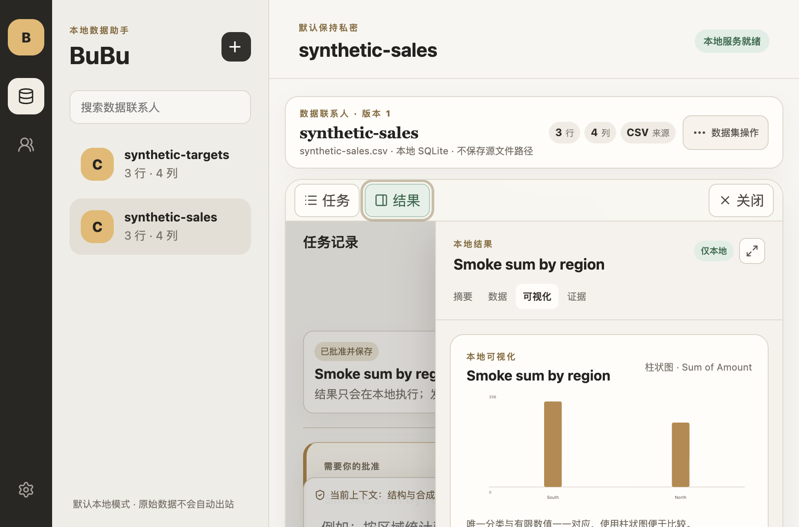
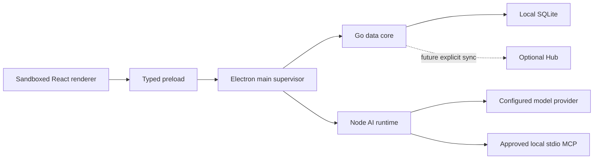

# BuBu

BuBu is a local-first AI data workspace for people who need to understand recurring Excel and CSV data without surrendering control of the underlying rows. Files are imported into a local analytical database; deterministic code profiles, validates, joins, queries, visualizes, and automates them; a remote model receives only the disclosure the user can see and approve.


The interaction model is conversation-first: a dataset or related dataset collection can hold multiple independent local task threads. The center stays readable as a chat; plans, results, charts, and audit evidence remain inspectable artifacts rather than getting lost in message text.



## What works now

- Atomic CSV, TSV, and XLSX import; local SQLite catalog; immutable replacement versions; schema-drift mapping; bounded preview, profiles, quality rules, and column distributions.
- Single-dataset and multi-table lookup analysis through typed plans. Conversations can be created, named by their first question, renamed, archived, restored, and resumed locally; the user sees the exact disclosure and approves before Go executes a bounded query; model-authored SQL never runs directly.
- Deterministic local bar and time-series charts, persisted task state, recoverable execution errors, and an expandable Artifact workspace for summaries, sortable/filterable data, visualization, evidence, and thread-bound automation. Interval/version triggers, cancellation, audit, backup, restore, hardened CSV export, and confirmed permanent deletion are implemented.
- OS-encrypted provider and stdio MCP configuration. MCP discovery invokes nothing; exact resource reads, prompt materialization, and one tool call each require a separate one-use review and remain local, untrusted, and outside model, Agent, and workflow authority.
- A packaged Electron desktop with a sandboxed React renderer, typed preload, supervised Node AI runtime, authoritative Go data core, native macOS/Windows sidecars and installers, synthetic UI smoke capture, and a 100 MiB reference performance gate. Pull requests exercise unsigned native packages; protected tags can assemble signed draft releases once owner credentials exist.

Still planned or incomplete: explicit-row disclosure, reusable Agent definitions, richer reports, remote MCP/OAuth, model-driven MCP use, Hub/RBAC/sync, signed installers, and updates. [PRODUCT_MANIFEST.yaml](PRODUCT_MANIFEST.yaml) is the machine-readable status authority; UI and documentation must never present `planned` or `in-progress` behavior as shipped.

## Product flow and privacy

1. Import files locally and inspect their shape and quality.
2. Start or resume a local task thread, then ask a question against one dataset or a 2–8 member group. On compact windows, **任务** and **结果** open as bounded drawers around the central chat.
3. Review the typed query plan and the exact schema, synthetic context, or aggregate that may leave the device.
4. Approve once; Go validates and executes the bounded plan locally.
5. Keep the result, chart, and audit trail in the local conversation workbench, or save the reviewed plan as a workflow.

| Boundary | Default | Authority |
| --- | --- | --- |
| Raw spreadsheet rows | Stay local | Go data core |
| Remote model input | Schema plus local synthetic examples | Visible disclosure review |
| Query execution | Typed plans only; no model SQL | Deterministic Go validation |
| Credentials | Write-only from the renderer; OS-encrypted | Electron main |
| Local MCP code | Untrusted; never auto-started | One-use user approval |
| MCP content/tool output | Local-only and untrusted | Never auto-inserted into model/Agent/workflow |

A prompt, provider response, workflow, or MCP server cannot raise its own disclosure level.

## Architecture



The renderer has no Node, filesystem, credential, provider, sidecar, or generic IPC access. Electron main owns lifecycle and OS integration, not business policy. Go is the final authority for raw-data disclosure and database execution. The optional Hub must never be required for local mode.

## Repository map

| Path | Responsibility | Guide |
| --- | --- | --- |
| `apps/desktop` | Electron lifecycle, secure preload, React product UI | [desktop README](apps/desktop/README.md) |
| `services/data-core` | Go file, SQLite, privacy, SQL, workflow, and audit authority | [data-core README](services/data-core/README.md) |
| `services/ai-runtime` | Provider, streaming, MCP, and bounded model adapters | [AI runtime README](services/ai-runtime/README.md) |
| `packages/contracts` | Versioned process-boundary schemas and parsers | [contracts README](packages/contracts/README.md) |
| `docs` | Architecture decisions, product guides, plans, and evidence | [documentation index](docs/README.md) |
| `scripts` | Executable repository, architecture, smoke, and performance contracts | [scripts README](scripts/README.md) |
| `bubu-bi` | Historical Wails migration source only | [legacy notice](bubu-bi/README.md) |

`packages/product-core`, `services/hub`, and remote sync are architectural destinations, not current directories. New code must not create placeholder implementations or imply they already exist.

## Desktop targets and release status

| Target | Engineering artifact | Public status |
| --- | --- | --- |
| macOS 13+ arm64 | DMG and ZIP | signing/notarization workflow implemented; signed evidence still required |
| macOS 13+ x64 | DMG and ZIP | signing/notarization workflow implemented; signed evidence still required |
| Windows 10 22H2 / Windows 11 x64 | Squirrel `Setup.exe`, `.nupkg`, and `RELEASES` | Azure Artifact Signing workflow implemented; signed evidence still required |
| Windows 11 arm64 | preview only | not part of a stable release |

The GitHub release job creates a draft, never an automatic public release. It adds deterministic names, native lifecycle reports, npm/Go CycloneDX SBOMs, SHA-256 checksums, and optional GitHub build provenance after signing. Automatic updates remain disabled. See [the release documentation](docs/release/README.md), [operator runbook](docs/release/release-runbook.md), and [public-beta gate](docs/release/public-beta-readiness.md).

## Develop and verify

Prerequisites are Node 22.18, npm 10.9.3, and Go 1.25; `.nvmrc`, Volta, package engines, and the Go module are executable constraints.

```bash
npm ci
npm run dev
```

Before review:

```bash
npm run verify
```

For a release version change, use the repository-owned command rather than editing workspace versions independently:

```bash
npm run version:set -- --version=0.2.0
npm run version:check
```

The root verification contract checks secrets and repository hygiene, documentation and GitHub contracts, architecture boundaries, dependencies, TypeScript and Go tests, production packaging, data-core/MCP/desktop smoke flows, and the reference performance budget. Generate synthetic packaged UI evidence with `npm run capture:ui`; generated screenshots contain no user data.

## Documentation

- [Conversation workbench](docs/product/conversation-workbench.md) and [product/UI/UX constraints](docs/product/ui-ux-guidelines.md)
- [Importing data](docs/product/importing-data.md), [data quality](docs/product/data-quality-and-validation.md), and [groups/relationships](docs/product/dataset-groups-and-relationships.md)
- [Querying and visualization](docs/product/querying-and-visualizations.md), [repeatable workflows](docs/product/repeatable-workflows.md), and [backup/recovery](docs/product/backup-and-recovery.md)
- [Local data kernel](docs/architecture/local-data-kernel.md), [privacy/provider boundary](docs/architecture/privacy-and-model-providers.md), and [MCP host security](docs/architecture/mcp-host-security.md)
- [Accepted product platform design](docs/plans/2026-07-17-bubu-product-platform-design.md) and [Electron migration plan](docs/plans/2026-07-17-electron-migration-implementation.md)
- [Platform support](docs/release/platform-support.md), [signed release runbook](docs/release/release-runbook.md), and [public-beta readiness](docs/release/public-beta-readiness.md)
- [Contributing](CONTRIBUTING.md) and [security reporting](SECURITY.md)

This repository is private and does not currently declare an open-source license. Do not redistribute or assume usage rights beyond the repository owner's authorization.
