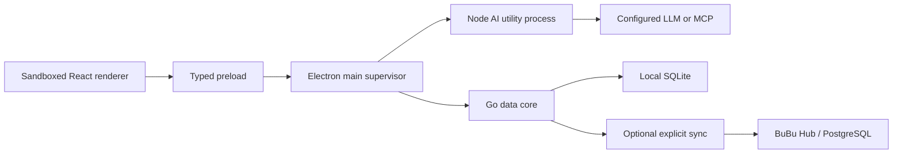

# BuBu

BuBu is a local-first AI data workspace for conversational Excel and CSV analysis. It imports data into a local analytical database, lets deterministic code profile and query it, and gives models only the schema, locally generated synthetic examples, or explicitly approved aggregates by default.

The product interaction treats a dataset as a contact and a dataset group as a group chat. Users can ask questions, validate formats, join files, create charts and reports, replace recurring data, and save repeatable work as workflows.

## Current status

The repository is migrating from the historical Wails prototype to a hardened Electron product:

- Implemented: Electron 43 secure shell, sandboxed React renderer, typed preload API, supervised Node AI utility process, Go data-core sidecar, authenticated versioned RPC, packaging, and packaged smoke verification.
- Implemented: atomic CSV/TSV/XLSX batch import, local SQLite catalog, first immutable dataset versions, bounded previews, type inference, and baseline column profiles.
- In progress: replacement versions, schema drift, richer quality profiles, validation, relationships, deletion, and export.
- Not complete yet: privacy gateway, safe query planning, production model adapters, dataset conversations, workflows, Agent/MCP/RAG, Hub/RBAC/sync, signing, and updates.

`PRODUCT_MANIFEST.yaml` is the machine-readable source for capability status. A disabled or planned feature must not be presented as shipped.

## Architecture



The renderer has no Node access. Electron main owns lifecycle, OS permissions, credentials, updates, and process supervision but not data policy. The Go data core is the final authority for raw-data disclosure and SQL execution. The optional Hub is never required for local mode and never shares a SQLite file between users.

See [the accepted product design](docs/plans/2026-07-17-bubu-product-platform-design.md), [the executable migration plan](docs/plans/2026-07-17-electron-migration-implementation.md), [the local data-kernel contract](docs/architecture/local-data-kernel.md), and [the import guide](docs/product/importing-data.md).

## Development

Prerequisites:

- Node 22.18+ or Node 24 LTS. Non-LTS releases are outside the reproducible build contract; Node 26 is also rejected because it prematurely exits Electron Packager 18.4.4 during asynchronous extraction.
- npm 10.9.3.
- Go 1.25+.

Use `.nvmrc` or the checked-in Volta configuration, then run:

```bash
npm install
npm run verify
```

Useful commands:

```bash
npm run dev                 # build sidecars and start Electron in development
npm test                    # TypeScript unit and contract tests
npm run test:data-core      # Go tests
npm run lint                # repository, architecture, and type gates
npm run build               # package the host platform application
npm run smoke:data-core     # import/list/preview against the built Go sidecar
npm run smoke:desktop       # launch the packaged app and verify both sidecars
```

Build output and user data are ignored. Credentials belong in OS-backed secure storage; databases, uploaded files, API keys, and local configuration must never be committed.

## Privacy defaults

Remote models receive no raw spreadsheet rows by default. The planned disclosure levels are:

1. schema only;
2. schema plus local non-reversible synthetic examples;
3. approved aggregates;
4. explicitly selected rows after visible confirmation.

A prompt, model response, workflow, or MCP server cannot raise its own disclosure level.
