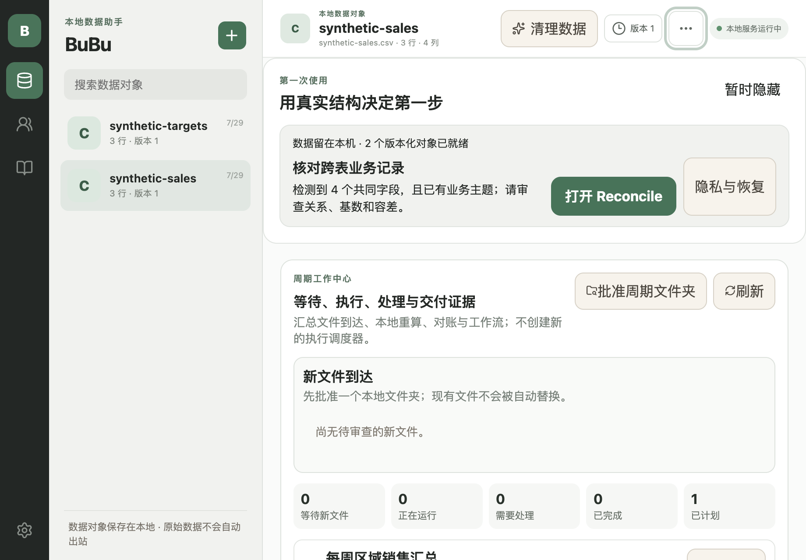
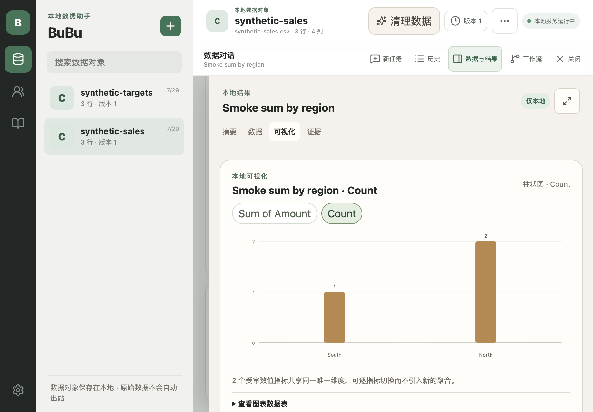
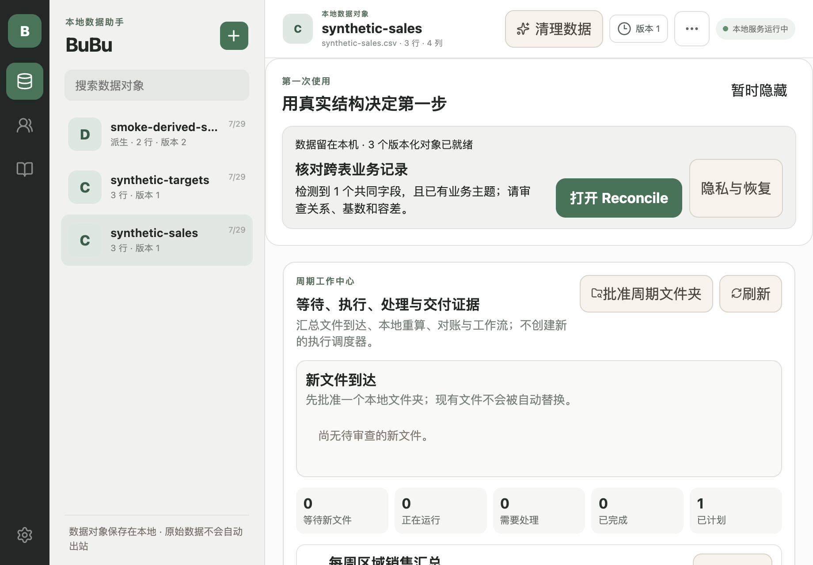
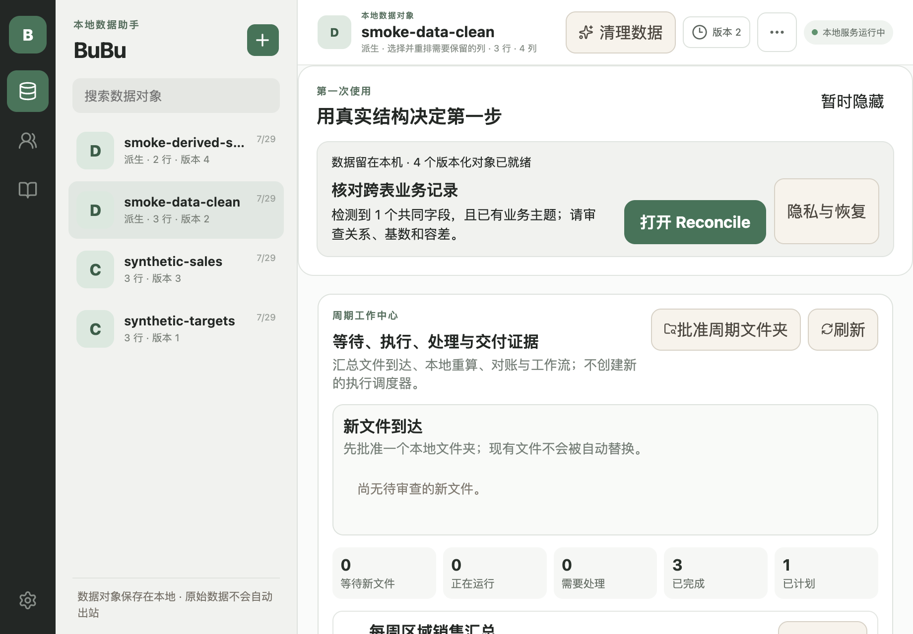
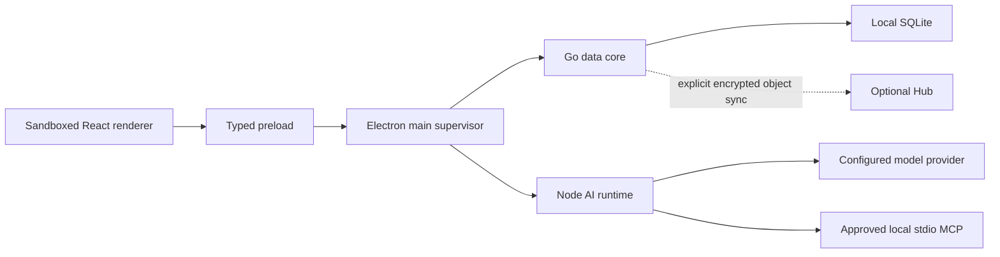

# BuBu

BuBu is a local-first AI data workspace for people who need to understand recurring Excel and CSV data without surrendering control of the underlying rows. Files are imported into a local analytical database; deterministic code profiles, validates, joins, queries, visualizes, and automates them; a remote model receives only the disclosure the user can see and approve.



The interaction model is conversation-first: imported Excel/CSV files become locally named data objects, and related objects form business topics with one-off, daily, weekly, monthly, or data-update rhythms. Each object or topic can hold multiple independent local task threads. History, results, and workflow stay in top-right drawers so the center remains a readable chat.





Reviewed Data Clean templates turn recurring local files into immutable derived objects. Source-version changes enqueue deterministic replay in Go; quality or schema drift pauses the affected branch with a visible remediation task, while a corrected source produces the next version without calling a model.



## What works now

Current release posture: **private beta** on the **preview** channel. The compact [product capability status](docs/product/capability-status.md) separates local outcomes, optional configured capabilities, external evidence still required, and future scope.

- Atomic CSV, TSV, and XLSX import; custom local object names; immutable replacement/version history; schema-drift mapping; bounded preview, profiles, quality rules, and column distributions.
- Five editable Data Clean templates, complete typed transformation grammar, one-use impact review, pre-activation quality gates, immutable lineage proof, idempotent downstream replay, restart recovery, retry/cancel, and privacy-safe completion notices.
- A direct Merge task imports three bounded same-schema weekly exports, opens the append template, requires an explicit second source and impact review, and creates a new immutable derived object without mutating either input.
- Single-dataset and multi-table lookup analysis through typed plans. Conversations can be created, named by their first question, renamed, archived, restored, and resumed locally; the user sees the exact disclosure and approves before Go executes a bounded query; model-authored SQL never runs directly.
- Deterministic local bar and time-series charts, persisted task state, recoverable execution errors, and an expandable Artifact workspace for summaries, sortable/filterable data, visualization, evidence, and thread-bound automation. Interval/version triggers, cancellation, audit, backup, restore, hardened CSV export, and confirmed permanent deletion are implemented.
- OS-encrypted provider and stdio MCP configuration. A main-owned strict-private mode limits remote planning to Schema only, while non-bypassable local DLP blocks likely credentials, PII, and pasted tables before every user-authored model request. MCP discovery invokes nothing; exact resource reads, prompt materialization, and one tool call each require a separate one-use review and remain local, untrusted, and outside model, Agent, and workflow authority.
- A packaged Electron desktop with a sandboxed React renderer, typed preload, supervised Node AI runtime, authoritative Go data core, native macOS/Windows sidecars and installers, synthetic UI smoke capture, and a 100 MiB reference performance gate. Pull requests exercise unsigned native packages; protected tags can assemble signed draft releases once owner credentials exist.

Still planned or incomplete: signed installers and trusted automatic updates, consented design-partner evidence, horizontal/normalized enterprise Hub scale, and unattended application of remotely received objects. Archived-task deletion and bounded optional retention, credential-free product-setting migration, lightweight structure-driven onboarding, explicit-row disclosure, workflow human approval, local RAG, bounded remote MCP Streamable HTTP/OAuth PKCE, approval-bound signed Webhook reminders, optional four-role Hub with encrypted workflow-definition Sync, reviewed digest-bound remote workflow application, the PostgreSQL adapter with real transaction evidence, MCP prompt-to-model, and separately approved single tool calls are implemented. Remote MCP resource/prompt/model use, raw-row sync, and arbitrary connector delivery remain unavailable. [PRODUCT_MANIFEST.yaml](PRODUCT_MANIFEST.yaml) is the machine-readable status authority; UI and documentation must never present `planned` behavior or uncollected external evidence as shipped.

## Product flow and privacy

1. Import files locally and inspect their shape and quality.
2. Start or resume a local task thread, then ask a question against one data object or a 2–8 member business topic. **历史**、**结果**和**工作流**始终从聊天右上角打开为有边界的抽屉，也可通过右键菜单进入。
3. Review the typed query plan and the exact schema, synthetic context, or aggregate that may leave the device.
4. Approve once; Go validates and executes the bounded plan locally.
5. Keep the result, chart, and audit trail in the local conversation workbench, or choose a business rhythm and **收尾为工作流**; the static/dynamic node graph shows processing, delivery, and the next update.

| Boundary | Default | Authority |
| --- | --- | --- |
| Raw spreadsheet rows | Stay local | Go data core |
| Remote model input | Schema plus local synthetic examples | Visible disclosure review |
| Query execution | Typed plans only; no model SQL | Deterministic Go validation |
| Credentials | Write-only from the renderer; OS-encrypted | Electron main |
| Local MCP code | Untrusted; never auto-started | One-use user approval |
| MCP content/tool output | Local-only and untrusted | Never auto-inserted into model/Agent/workflow |

A prompt, provider response, workflow, or MCP server cannot raise its own disclosure level.

## Architecture


```mermaid
flowchart LR
    UI["Sandboxed React renderer"] --> PRE["Typed preload"]
    PRE --> MAIN["Electron main supervisor"]
    MAIN --> DATA["Go data core"]
    MAIN --> AI["Node AI runtime"]
    DATA --> DB["Local SQLite"]
    AI --> MODEL["Configured model provider"]
    AI --> MCP["Approved local stdio MCP"]
    DATA -. "explicit encrypted object sync" .-> HUB["Optional Hub"]
```

The renderer has no Node, filesystem, credential, provider, sidecar, or generic IPC access. Electron main owns lifecycle and OS integration, not business policy. Go is the final authority for raw-data disclosure and database execution. The optional Hub must never be required for local mode.

## Repository map

| Path | Responsibility | Guide |
| --- | --- | --- |
| `apps/desktop` | Electron lifecycle, secure preload, React product UI | [desktop README](apps/desktop/README.md) |
| `services/data-core` | Go file, SQLite, privacy, SQL, workflow, and audit authority | [data-core README](services/data-core/README.md) |
| `services/ai-runtime` | Provider, streaming, MCP, and bounded model adapters | [AI runtime README](services/ai-runtime/README.md) |
| `services/hub` | Optional tenant, RBAC, encrypted object sync, conflict, and signed-audit authority | [Hub README](services/hub/README.md) |
| `packages/contracts` | Versioned process-boundary schemas and parsers | [contracts README](packages/contracts/README.md) |
| `packages/product-core` | Pure cross-host product policy and presets | [product-core README](packages/product-core/README.md) |
| `docs` | Current guides, architecture decisions, strategy proposals, and historical evidence | [documentation index](docs/README.md) |
| `scripts` | Executable repository, architecture, smoke, and performance contracts | [scripts README](scripts/README.md) |

`services/hub` is an optional, independently started service; local desktop mode never waits for or depends on it. The V1 Hub stores only explicit end-to-end encrypted product objects and signed control-plane evidence. The retired Wails prototype remains only in Git history and the documented retirement record.

## Desktop targets and release status

| Target | Engineering artifact | Public status |
| --- | --- | --- |
| macOS 13+ arm64 | DMG and ZIP | signing/notarization workflow implemented; signed evidence still required |
| macOS 13+ x64 | DMG and ZIP | signing/notarization workflow implemented; signed evidence still required |
| Windows 10 22H2 / Windows 11 x64 | Squirrel `Setup.exe`, `.nupkg`, and `RELEASES` | Azure Artifact Signing workflow implemented; signed evidence still required |
| Windows 11 arm64 | preview only | not part of a stable release |

The GitHub release job creates a draft, never an automatic public release. It adds deterministic names, native lifecycle reports, npm/Go CycloneDX SBOMs, SHA-256 checksums, and optional GitHub build provenance after signing. Automatic updates remain disabled. See [the release documentation](docs/release/README.md), [operator runbook](docs/release/release-runbook.md), and [public-beta gate](docs/release/public-beta-readiness.md).

## Develop and verify

Prerequisites are Node 22.18, npm 10.9.3, and Go 1.25; `.nvmrc`, Volta, package engines, and the Go module are executable constraints.

```bash
npm ci
npm run dev
```

Before review:

```bash
npm run verify
```

For a release version change, use the repository-owned command rather than editing workspace versions independently:

```bash
npm run version:set -- --version=0.2.0
npm run version:check
```

The root verification contract checks secrets and repository hygiene, documentation and GitHub contracts, architecture boundaries, dependencies, TypeScript and Go tests, production packaging, data-core/MCP/desktop smoke flows, and the reference performance budget. Generate synthetic packaged UI evidence with `npm run capture:ui`; generated screenshots contain no user data.

## Documentation

- [Product capability status](docs/product/capability-status.md), [conversation workbench](docs/product/conversation-workbench.md), and [product/UI/UX constraints](docs/product/ui-ux-guidelines.md)
- [Importing data](docs/product/importing-data.md), [data quality](docs/product/data-quality-and-validation.md), and [groups/relationships](docs/product/dataset-groups-and-relationships.md)
- [Querying and visualization](docs/product/querying-and-visualizations.md), [local business knowledge](docs/product/local-knowledge.md), [repeatable workflows](docs/product/repeatable-workflows.md), and [backup/recovery](docs/product/backup-and-recovery.md)
- [Local data kernel](docs/architecture/local-data-kernel.md), [privacy/provider boundary](docs/architecture/privacy-and-model-providers.md), and [MCP host security](docs/architecture/mcp-host-security.md)
- [Strategy proposals](docs/strategy/README.md) and [historical implementation evidence](docs/history/README.md)
- [Platform support](docs/release/platform-support.md), [signed release runbook](docs/release/release-runbook.md), and [public-beta readiness](docs/release/public-beta-readiness.md)
- [Contributing](CONTRIBUTING.md) and [security reporting](SECURITY.md)

This repository is public so that community preview releases can use GitHub's free standard runners. It does not currently declare an open-source license; public visibility does not grant redistribution or usage rights beyond the repository owner's authorization.
