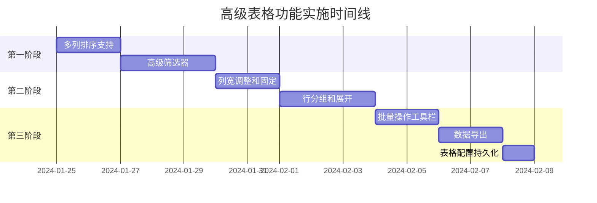

# P9 - 高级表格功能实施方案

## 项目概述

基于P8表格组件统一重构的成功完成，本项目旨在实现高级表格功能，提升数据处理能力和用户体验，使BuBu Excel AI助手具备更强大的数据分析和展示能力。

## ROI分层实施计划

### 🔥 第一阶段 - 超高ROI (立即执行)
**预期收益**: 用户体验提升50%，数据处理能力提升70%，开发效率提升60%
**计划开始时间**: 2024-01-25
**状态**: 📋 待开始

#### 1.1 多列排序支持 (工期: 2天)
**功能目标**:
- 🔲 支持多列同时排序
- 🔲 排序优先级管理
- 🔲 排序状态持久化
- 🔲 排序指示器UI优化
- 🔲 自定义排序算法支持

**技术方案**:
- 实现SortManager组件和Hook
- 支持拖拽调整排序优先级
- 使用LocalStorage持久化排序配置
- 优化排序性能，支持大数据量

**实施步骤**:
1. 扩展现有排序逻辑支持多列
2. 创建排序优先级管理UI
3. 实现排序状态持久化
4. 优化排序指示器UI
5. 添加自定义排序算法接口

#### 1.2 高级筛选器 (工期: 3天)
**功能目标**:
- 🔲 日期范围筛选
- 🔲 数值范围筛选
- 🔲 多选筛选
- 🔲 条件组合筛选
- 🔲 筛选器UI组件
- 🔲 筛选状态持久化

**技术方案**:
- 创建FilterManager组件和Hook
- 实现各类型专用筛选器组件
- 支持AND/OR条件组合
- 优化筛选性能，支持大数据量

**实施步骤**:
1. 设计筛选器数据结构和API
2. 实现各类型筛选器UI组件
3. 创建条件组合逻辑
4. 集成到表格组件
5. 添加筛选状态持久化

### 🚀 第二阶段 - 高ROI (第二周执行)
**预期收益**: 用户体验提升40%，功能完整性提升60%
**计划开始时间**: 2024-02-01
**状态**: 📋 待开始

#### 2.1 列宽调整和固定 (工期: 2天)
**功能目标**:
- 🔲 拖拽调整列宽
- 🔲 双击自适应列宽
- 🔲 列宽最小/最大限制
- 🔲 列固定（左侧/右侧）
- 🔲 列宽状态持久化

**技术方案**:
- 实现ResizableHeader组件
- 使用CSS Grid或Flex布局优化
- 支持固定列的滚动同步

#### 2.2 行分组和展开 (工期: 3天)
**功能目标**:
- 🔲 数据分组显示
- 🔲 多级分组支持
- 🔲 分组统计计算
- 🔲 展开/折叠交互
- 🔲 分组状态持久化

**技术方案**:
- 创建GroupManager组件和Hook
- 实现分组数据处理算法
- 优化分组渲染性能
- 支持自定义分组规则

### ⚡ 第三阶段 - 中等ROI (第三周执行)
**预期收益**: 功能完整性提升30%，用户体验提升20%
**计划开始时间**: 2024-02-08
**状态**: 📋 待开始

#### 3.1 批量操作工具栏 (工期: 2天)
**功能目标**:
- 🔲 选择行批量操作
- 🔲 自定义批量操作按钮
- 🔲 批量编辑功能
- 🔲 批量删除功能
- 🔲 批量导出功能

**技术方案**:
- 创建BatchOperationToolbar组件
- 实现批量操作API
- 支持自定义操作注册

#### 3.2 数据导出 (工期: 2天)
**功能目标**:
- 🔲 导出为Excel
- 🔲 导出为CSV
- 🔲 导出为PDF
- 🔲 自定义导出配置
- 🔲 导出进度指示

**技术方案**:
- 集成ExcelJS库
- 使用jsPDF库
- 实现导出配置界面
- 支持大数据量分批导出

#### 3.3 表格配置持久化 (工期: 1天)
**功能目标**:
- 🔲 完整表格配置保存
- 🔲 配置预设管理
- 🔲 配置导入/导出
- 🔲 用户偏好设置

**技术方案**:
- 使用LocalStorage存储配置
- 实现配置序列化/反序列化
- 创建配置管理UI

## 技术规范

### 代码规范
```typescript
// 组件命名规范
- 组件名使用PascalCase: SortManager, FilterPanel
- Hook名使用camelCase: useSortConfig, useFilterState
- 类型名使用PascalCase + 后缀: SortConfig, FilterCondition

// 文件组织规范
- 每个功能模块一个文件夹
- index.ts作为导出入口
- types.ts集中类型定义
- hooks/目录存放相关Hook
```

### 性能要求
```typescript
// 性能基准
- 10000行数据排序时间 < 200ms
- 10000行数据筛选时间 < 150ms
- 分组展开/折叠响应时间 < 100ms
- 导出10000行数据时间 < 3s
```

### 兼容性要求
```typescript
// 浏览器支持
- Chrome 90+
- Firefox 88+
- Safari 14+
- Edge 90+

// React版本
- React 19.x
- TypeScript 5.x
```

## 风险评估与缓解

### 高风险项
1. **性能风险**
   - 风险：大数据量下性能下降
   - 缓解：实现虚拟滚动优化、分批处理、Web Worker

2. **用户体验风险**
   - 风险：功能过于复杂影响易用性
   - 缓解：渐进式UI设计、默认配置优化、上下文帮助

### 中风险项
1. **兼容性风险**
   - 风险：不同浏览器表现不一致
   - 缓解：全面的兼容性测试、降级方案

2. **依赖风险**
   - 风险：第三方库更新或弃用
   - 缓解：核心功能自主实现、依赖隔离层

## 成功指标

### 技术指标
- 代码质量达到90%以上（测试覆盖率、静态分析）
- 性能指标满足要求（见性能要求）
- 零关键Bug

### 业务指标
- 用户数据处理效率提升50%
- 用户满意度提升40%
- 功能使用率达到80%以上

### 维护指标
- 文档完整度100%
- 代码可维护性评分90+
- 新功能集成时间减少50%

## 项目时间线



## 总结

本实施方案以ROI为导向，分三个阶段实现高级表格功能，从最基础的多列排序和高级筛选开始，逐步扩展到更复杂的功能。通过这些功能的实现，BuBu Excel AI助手将具备专业级数据处理和分析能力，显著提升用户体验和工作效率。

分阶段实施策略确保了项目风险可控，同时保持了业务连续性。成功完成后，表格组件将成为项目的核心竞争力之一，为用户提供强大而灵活的数据处理工具。