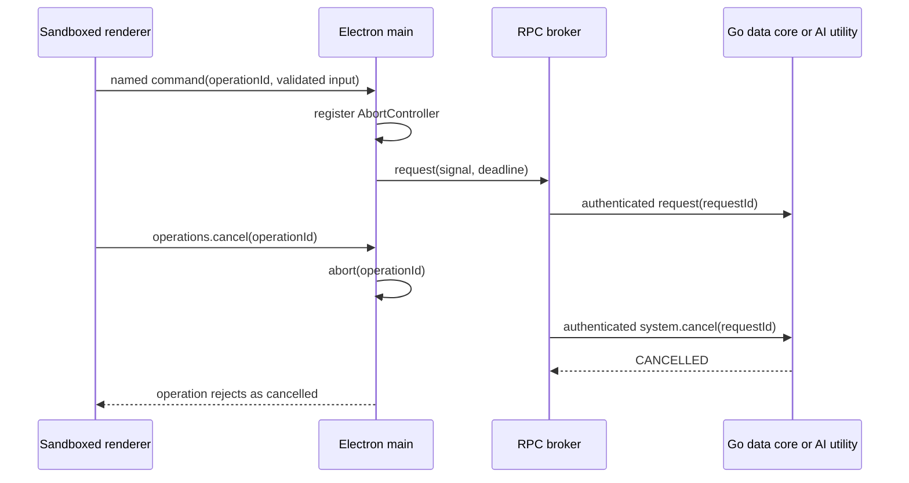

# Cancellation and Operation Budgets

BuBu keeps the interface responsive by giving every potentially long-running user action a UUID operation identity. Cancellation is a named product command, not a generic IPC channel and not a process kill.

## Supported operations

The desktop exposes cancellation for import, replacement, mapped replacement, export, backup, restore, local distribution scans, model planning, single-dataset queries, and group queries. Changing the selected distribution column also cancels the obsolete scan automatically.

Permanent dataset deletion is deliberately different. It requires a native destructive confirmation and then completes as one short SQLite transaction. Once confirmed, it is not cancellable because reporting an ambiguous half-cancelled destructive commit would be less safe than finishing the atomic operation.

Native open/save/confirmation dialogs keep their operating-system Cancel action. The operation registry begins when the selected file operation starts; cancelling a dialog does not create background work.

## End-to-end control path

The renderer generates an operation UUID and can only call the named `operations.cancel` API. Electron main validates the UUID, owns the corresponding `AbortController`, and removes it in `finally`. Concurrent reuse of an active identity is rejected.

The RPC broker has independent deadlines: ten minutes for local data operations and 130 seconds for model operations. Either a user abort or a deadline removes the pending request, rejects its caller, and sends an authenticated `system.cancel` control message for the original RPC request ID.

The Go server reads cancellation controls concurrently but executes normal data requests through one serialized worker. This preserves SQLite's single-owner mutation model while allowing `context.Context` cancellation to interrupt streaming file reads, queries, backups, and transactional work. A cancelled failed request has the stable `CANCELLED` code; transaction rollback remains the responsibility of the data operation.

The AI utility keeps one `AbortController` per active request. Its dispatcher handles authenticated cancellation independently of the provider promise and propagates the signal into `fetch`. Provider requests also have a 120-second network deadline.

## Completion semantics

- Cancellation is cooperative. Every long boundary accepts an `AbortSignal` or Go `context.Context` and checks it through the I/O or database API it uses.
- A successful durable response wins. If a transaction committed and returned successfully before cancellation reached it, the UI treats it as success.
- A cancelled transaction must not expose staged imports, replacement versions, partial backups, or a partially installed restore.
- Late cancellation returns `cancelled: false`; this means the operation already left the active registry, not that it is still running.
- Model and data processes remain alive after cancellation, so another operation can start without a restart.

## Verification

Contract tests reject malformed operation identities and envelopes. Desktop tests prove active-operation cancellation and authenticated RPC control emission. AI tests abort an in-flight provider request. Go server tests prove a cancellation control can interrupt the active serialized data request. The architecture fitness gate requires every layer of this control path and the documented timeout budgets.
