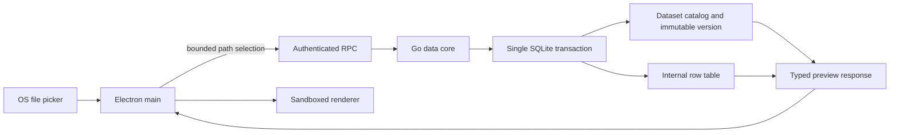

# Local data-kernel contract

Status: Implemented foundation; remaining data capabilities are listed below.

Owner: `services/data-core`.

Boundary: Authenticated local stdio RPC; no listening network socket.

## Responsibility

The Go data core is the authority for file ingestion and local dataset persistence. Electron main may present an operating-system file dialog and pass the selected paths to the sidecar. The renderer never receives those paths and cannot open files, SQLite, or a generic RPC channel.

The current data flow is:

## Import semantics

- Accepted formats are CSV, TSV, and XLSX. Legacy binary `.xls` is deliberately rejected.
- Delimiter detection reads at most 64 KiB. CSV and TSV rows are streamed rather than loading the complete file into memory.
- The first CSV record is the header. For XLSX, the first non-empty row in each sheet is the header and every non-empty sheet becomes one dataset contact.
- Headers are trimmed, empty headers receive stable names, and duplicates receive deterministic suffixes.
- Source values are stored as text or null. This preserves identifiers such as `001`; inferred types are metadata and never destructively coerce the source value.
- A multi-file selection is one transaction. If any file, sheet, or row fails, no dataset from that selection becomes visible.
- A source file path is used only while importing. The catalog stores the source file name, SHA-256, size, and import time, but not its absolute path or a second source-file copy.
- One selection accepts at most 100 files. Each RPC message is bounded to 1 MiB.

## Local schema

`schema_migrations` records monotonic migrations. `datasets` is the stable contact identity. `dataset_versions` records immutable materializations and points to a validated internal table name. `dataset_columns` stores ordered semantic names, physical names, inferred types, nullability, null count, distinct count, and lexical minimum/maximum.

`dataset_groups` stores a local group identity and label. `dataset_group_members` stores an ordered relationship to 2–8 stable dataset contacts, not a row copy or pinned SQLite table. Reading a group resolves every contact's current ready immutable version; replacing a member therefore updates what the group sees without mutating historical versions. Foreign keys delete orphan membership automatically while group deletion never deletes a dataset.

`conversation_threads` attaches one private primary timeline to a stable dataset/group target. `conversation_entries` stores monotonic typed question/plan/result/error artifacts. The renderer can read these artifacts through a narrow API but only Electron main can request an append after the relevant planning/execution boundary succeeds or fails.

Every imported dataset starts at version 1. Replacing a dataset with the same normalized columns creates an immutable next version under the same contact identity and atomically switches the current version. Missing, added, or reordered columns return a structured drift result and leave the current version unchanged. Interactive mapping requires a total one-to-one mapping from every stable current column to a distinct incoming normalized column. Extra incoming columns are explicitly ignored. The renderer receives only a random one-use token; Electron main keeps the source path for at most ten minutes, and the Go data core revalidates the mapping before it creates and activates a new immutable version.

`dataset_validation_rules` stores at most 100 ordered deterministic rules against stable logical column names. Reports always resolve the current ready version, derive bounded local findings from stored profiles, and execute required, uniqueness, numeric-range, RE2 pattern, and allow-list checks in the Go data core. Failure artifacts contain counts and at most 20 row numbers, never raw failing values. Rules survive compatible replacements and are deleted with their dataset contact.

`dataset_relationships` stores directional many-to-one lookup semantics between stable dataset contacts and logical column names. Discovery is deterministic and bounded to 500 same-name candidates with compatible types and a non-empty, non-null, unique current right key. Saved relationships are reassessed against current versions on every group read. Invalid relationships remain visible but do not enter the model disclosure. Go query execution independently repeats its right-key and connected-tree validation.

CSV export resolves the current ready version and streams it to a same-directory restricted temporary file. A UTF-8 BOM supports Excel interoperability, while text-shaped formula prefixes are neutralized without changing numeric negatives. The final response contains a base name rather than an absolute path. Permanent deletion first collects internally generated physical table names, then deletes dependent conversations/undersized groups, deletes the stable dataset identity, repairs surviving groups, drops every version table, and commits as one SQLite transaction. Membership is bounded to 100 groups per dataset so its deletion artifact is bounded as well.

Local backup uses `VACUUM INTO` to create a consistent standalone snapshot, then streams it into a strict two-entry `.bubu-backup` container with a SHA-256-bound manifest. Restore stages and validates the complete artifact before closing the live connection. It rejects unknown schema objects, views/triggers, invalid migrations or foreign keys, incomplete versions, persisted source locators, and bounded-state violations. Installation keeps the prior database under a restricted rollback name until the restored database opens and migrates successfully; startup also repairs an interrupted swap.

Column distribution profiling is lazy and one-column-at-a-time. Numeric columns use a local mean plus at most ten equal-width bins; categorical columns return at most ten groups, bounded 120-rune display previews, and an aggregate remainder count. The response is marked `localOnly: true` and is not accepted by either single/group model-context construction. This prevents richer local exploration from becoming an implicit raw-value disclosure channel.

## Safe analytical queries

The data core accepts a versioned typed query plan, never SQL text. A plan can select up to eight dimensions and eight measures, apply up to twenty allow-listed filters, sort up to three selected outputs, and return at most 200 rows. Supported measures are count, sum, average, minimum, and maximum. All dataset/column references must match the current immutable version.

A group plan contains 2–8 sources in stored member order and exactly one fewer join. Joins form a deterministic connected tree: each join adds the next source to an already connected source, so cross joins, cycles, skipped sources, and reordered sources are invalid. Only inner and left equality joins are supported. Every right-side join key must be non-null and unique according to the local profile, which keeps lookup cardinality bounded by the left side and prevents an accidental many-to-many explosion. The model context exposes only the safe `unique` boolean, not distinct counts or values.

Only validated internal table/physical-column names enter generated SQL. Filter values are always bound parameters; substring filters use `instr` rather than wildcard-bearing SQL fragments. Numeric operations are permitted only for inferred numeric columns. The compiler emits one `SELECT`, requests one extra row to prove truncation, and returns a strict typed result. A stale version, unknown column, unsupported operation, invalid numeric filter, or oversized plan fails before execution.

## Security and privacy invariants

- The database directory is created with mode `0700` and the SQLite file with mode `0600` on platforms that expose POSIX permissions.
- Dynamic table and column identifiers are generated internally and matched against strict regular expressions before SQL interpolation. User-controlled values use bound parameters.
- Renderer/model output cannot submit SQL. Even after UI approval, Go independently decodes the strict plan, rejects unknown fields, validates the current version, and compiles the bounded query.
- RPC requests require a random per-process credential and protocol version 1.
- Preview is bounded to 1–500 rows. The current UI requests 50 rows.
- No import operation calls a model or sends a network request.
- Filename and profile metadata are local product data. A future privacy gateway must still decide whether any of them may enter a model disclosure envelope.

## Implemented checks

- CSV, TSV, multi-sheet XLSX, header normalization, type inference, and leading-zero preservation.
- Transaction rollback for malformed rows and for an entire multi-file selection.
- Same-schema and explicitly mapped replacement, monotonic version numbers, schema-drift blocking, one-use path-private mapping sessions, and migration from the version-1 catalog.
- Transactional create/update/delete and current-version resolution for ordered local dataset groups.
- Catalog and preview integration through temporary SQLite databases.
- Built-sidecar smoke for import, list, inference, preview, file permissions, and absolute-path non-persistence.
- Typed aggregation, hostile bound-filter, stale-version, unknown-column, numeric-operation, limit, and truncation tests plus built-sidecar query smoke.
- Multi-table left lookup, post-join aggregation, hostile filters, stale/reordered membership, disconnected trees, and non-unique right-key rejection.
- Architecture fitness rule that rejects whole-file CSV delimiter sampling.
- Type-aware numeric profile bounds, deterministic quality findings, transactional validation-rule persistence, strict rule operands, and bounded failure samples.
- Deterministic relationship discovery, directional persistence, current-version invalidation, strict RPC decoding, and schema-only ready-relationship model hints.
- Streaming current-version CSV export, UTF-8/Excel formula hardening, restricted file permissions, path-private typed results, and built-sidecar smoke.
- Transactional permanent deletion of all version tables and dependent private state, bounded group repair, native destructive confirmation, and integration tests.
- Consistent local snapshot archive, strict hash/schema/privacy restore validation, destructive native confirmation, database rollback, interrupted-swap recovery, and round-trip integration/binary smoke.
- On-demand numeric/categorical distributions, deterministic ordering, bounded/sanitized value previews, explicit local-only contracts, UI exploration, and binary smoke.

## Not implemented yet

Operation cancellation and reference-device 100 MB performance measurement remain Stage 2 work. The product manifest must keep these capabilities planned or in progress until their runtime, tests, and documentation agree.
