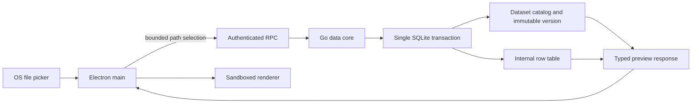

# Local data-kernel contract

Status: Implemented foundation; remaining data capabilities are listed below.

Owner: `services/data-core`.

Boundary: Authenticated local stdio RPC; no listening network socket.

## Responsibility

The Go data core is the authority for file ingestion and local dataset persistence. Electron main may present an operating-system file dialog and pass the selected paths to the sidecar. The renderer never receives those paths and cannot open files, SQLite, or a generic RPC channel.

The current data flow is:

## Import semantics

- Accepted formats are CSV, TSV, and XLSX. Legacy binary `.xls` is deliberately rejected.
- Delimiter detection reads at most 64 KiB. CSV and TSV rows are streamed rather than loading the complete file into memory.
- The first CSV record is the header. For XLSX, the first non-empty row in each sheet is the header and every non-empty sheet becomes one dataset contact.
- Headers are trimmed, empty headers receive stable names, and duplicates receive deterministic suffixes.
- Source values are stored as text or null. This preserves identifiers such as `001`; inferred types are metadata and never destructively coerce the source value.
- A multi-file selection is one transaction. If any file, sheet, or row fails, no dataset from that selection becomes visible.
- A source file path is used only while importing. The catalog stores the source file name, SHA-256, size, and import time, but not its absolute path or a second source-file copy.
- One selection accepts at most 100 files. Each RPC message is bounded to 1 MiB.

## Local schema

`schema_migrations` records monotonic migrations. `datasets` is the stable contact identity. `dataset_versions` records immutable materializations and points to a validated internal table name. `dataset_columns` stores ordered semantic names, physical names, inferred types, nullability, null count, distinct count, and lexical minimum/maximum.

Every imported dataset currently starts at version 1. Replacement is intentionally not emulated by creating an unrelated contact; it remains unavailable until schema-drift and mapping behavior are implemented together.

## Security and privacy invariants

- The database directory is created with mode `0700` and the SQLite file with mode `0600` on platforms that expose POSIX permissions.
- Dynamic table and column identifiers are generated internally and matched against strict regular expressions before SQL interpolation. User-controlled values use bound parameters.
- RPC requests require a random per-process credential and protocol version 1.
- Preview is bounded to 1–500 rows. The current UI requests 50 rows.
- No import operation calls a model or sends a network request.
- Filename and profile metadata are local product data. A future privacy gateway must still decide whether any of them may enter a model disclosure envelope.

## Implemented checks

- CSV, TSV, multi-sheet XLSX, header normalization, type inference, and leading-zero preservation.
- Transaction rollback for malformed rows and for an entire multi-file selection.
- Catalog and preview integration through temporary SQLite databases.
- Built-sidecar smoke for import, list, inference, preview, file permissions, and absolute-path non-persistence.
- Architecture fitness rule that rejects whole-file CSV delimiter sampling.

## Not implemented yet

Dataset replacement and drift, richer distributions and anomaly findings, validation rules, relationships, read-only analytical queries, export, deletion, backup/recovery, cancellation, and reference-device 100 MB performance measurement remain Stage 2 work. The product manifest must keep these capabilities planned or in progress until their runtime, tests, and documentation agree.
