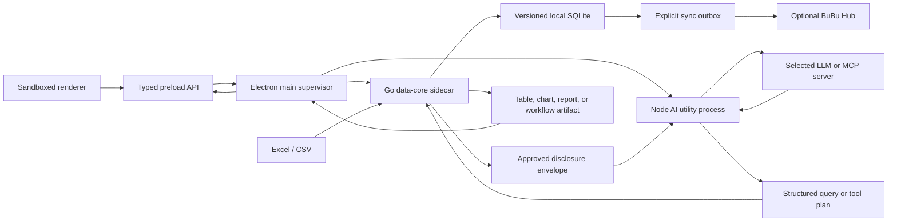

# BuBu Local-First AI Data Platform Design

**Status:** Accepted
**Date:** 2026-07-17
**Owner:** BuBu product and engineering
**Decision basis:** The repository audit, the approved remediation direction, and the request to complete the full local AI data platform.

## 1. Product definition

BuBu is a local-first AI data workspace for people who need to understand, validate, transform, join, visualize, and repeatedly process Excel and CSV data without sending raw business data to a cloud model by default.

The primary interaction is a data conversation:

- A dataset behaves like a contact.
- A dataset group behaves like a group chat.
- Messages can ask questions, request transformations, run reusable workflows, explain data quality issues, or create visual results.
- Raw rows remain local unless an explicit privacy policy and a user approval allow a bounded disclosure.
- Local models can be used for fully offline operation.
- A company can optionally attach BuBu to a BuBu Hub for identity, policy, workflow, and metadata collaboration.

BuBu is not an Excel clone, a generic chatbot, or a cloud BI warehouse. Excel and CSV are import and export formats; SQLite is the local analytical execution engine; AI plans and explains operations; deterministic code validates and executes them.

## 2. Product modes

### 2.1 Local private mode

- Default after installation.
- Files, imported tables, profiles, conversations, workflows, and audit records are stored locally.
- No company server is configured.
- A local model can provide a zero-cloud workflow.
- A cloud model can receive only the disclosure envelope allowed by the active privacy policy.

### 2.2 Bring-your-own-model mode

- Users configure one or more model providers.
- Credentials are stored in the operating-system credential store, never in tracked configuration.
- Workload profiles route requests by capability, cost, latency, and privacy requirements.
- Provider-specific features are exposed only after capability negotiation.

### 2.3 Enterprise collaboration mode

- Explicit opt-in during advanced installation or later in settings.
- BuBu Hub provides device identity, users, groups, RBAC, audit, policy distribution, workflow sharing, and encrypted metadata or snapshot synchronization.
- A shared SQLite file is never used as a multi-user server.
- Raw dataset synchronization is a separate, explicit permission from metadata and workflow sharing.

### 2.4 Desktop runtime decision

BuBu will migrate from Wails to a hardened Electron shell, but it will not become an all-Node application. The runtime is split by responsibility:

1. A sandboxed React renderer owns presentation and local interaction state.
2. A narrow typed preload API exposes named product commands; the renderer never receives generic IPC access.
3. Electron main owns windows, lifecycle, dialogs, permissions, credentials, updates, and child-process supervision.
4. A Node utility process owns fast-moving AI provider SDKs, response streaming, and MCP protocol translation.
5. A Go data-core sidecar owns files, streaming CSV/XLSX ingestion, SQLite, profiling, validation, privacy evaluation, query execution, workflow persistence, and audit.

The main process starts both runtimes and communicates through authenticated, versioned local RPC over process pipes. Neither sidecar opens a network listener. The renderer cannot address a sidecar directly.

This change is deliberate: Electron provides the consistent Chromium runtime, mature packaging and update path, and Node AI/MCP ecosystem expected of a Codex- or Claude-class desktop agent. Go remains the stronger existing asset for BuBu's local data plane. The migration is complete only after the Wails bridge and generated bindings are deleted.

## 3. Capability map

| Capability | Product behavior | Default privacy boundary |
| --- | --- | --- |
| Import | CSV/XLSX to versioned local datasets | Fully local |
| Profiling | Types, nulls, uniqueness, ranges, distributions, anomalies | Fully local |
| Validation | Reusable column, row, relationship, and business rules | Fully local |
| Natural-language analysis | Intent to a typed query plan and safe SQL | Schema and approved summaries only |
| Multi-table analysis | Explicit relationships, join suggestions, lookup and reconciliation | Fully local execution |
| Visualization | Typed chart specifications rendered locally | Aggregated result only |
| Conversations | Dataset contacts, groups, messages, artifacts, citations | Local by default |
| Replacement | Version a recurring dataset and compare schema or quality drift | Fully local |
| Automation | Deterministic workflows with bounded AI steps | Per-step policy |
| Agent | Plan, call tools, observe, and stop within a declared budget | Least-privilege tools |
| MCP | Local and remote tools, resources, and prompts | Host-enforced consent |
| RAG | Local documents, schema knowledge, business definitions, and cited retrieval | Local index by default |
| Collaboration | Share policies, workflows, profiles, and optional snapshots | Explicit server and ACL |
| Export | CSV/XLSX, chart images, and report artifacts | User-confirmed file write |

## 4. AI capability architecture

### 4.1 Provider contract

Business modules depend on an internal `ModelProvider` port rather than a vendor SDK. A provider advertises a capability set:

- text and streaming;
- structured output;
- function or tool calling;
- embeddings and optional reranking;
- vision and document input;
- reasoning controls;
- prompt caching and usage reporting;
- managed web, file, code, image, audio, realtime, or batch tools when supported.

Initial adapters:

1. OpenAI Responses API.
2. Anthropic Messages API.
3. Google Gemini Interactions API.
4. OpenAI-compatible API for Volcengine Ark, compatible gateways, and custom endpoints.
5. Ollama for local chat, tools, vision, and embeddings.

Model identifiers remain configuration data. BuBu discovers models when an endpoint supports discovery and never makes product correctness depend on one fashionable model name.

### 4.2 Tool and MCP contract

All actions are represented as typed tools with JSON Schema inputs and outputs. Internal tools and MCP tools enter one registry, but retain origin, trust level, side-effect classification, and approval policy.

MCP follows the host-client-server model:

- BuBu is the host and owns consent, policy, conversation context, and tool routing.
- Each MCP server receives an isolated client connection.
- Supported transports are local stdio and remote Streamable HTTP.
- The first implementation supports tools, resources, prompts, lifecycle negotiation, progress, cancellation, and structured errors.
- Remote MCP uses OAuth or explicit bearer credentials; local stdio credentials come from the environment or credential store.
- One server cannot see another server or the full conversation unless BuBu explicitly supplies the required context.

### 4.3 Agent and workflow contract

A workflow is the durable product primitive. An agent is an optional reasoning step inside a workflow, not the owner of persistence or permissions.

The workflow engine is a deterministic state machine with:

- versioned definitions;
- typed inputs and outputs;
- retries, timeouts, cancellation, and idempotency keys;
- human approval nodes for destructive, external, costly, export, or share actions;
- a maximum step, token, time, and cost budget;
- resumable execution and an append-only trace;
- schedules and dataset-version triggers.

Agent runs use a bounded plan-act-observe loop. Tools are filtered before every model call. Structured outputs are validated. A tool result can never directly grant broader authority to a later step.

### 4.4 RAG contract

RAG is used for business definitions, data dictionaries, validation policies, workflow documentation, and user-provided knowledge. It is not used to send spreadsheet rows to a hosted vector service by default.

The local pipeline is:

1. parse and normalize;
2. semantic chunking with stable source identifiers;
3. embed through the selected local or cloud embedding provider;
4. store metadata, text, and vectors locally;
5. hybrid keyword and vector retrieval;
6. optional reranking;
7. context assembly under a token and disclosure budget;
8. response with source citations.

The first release uses SQLite FTS5 plus a provider-neutral vector store port. A simple local vector adapter is acceptable for desktop-sized corpora; BuBu Hub uses PostgreSQL with a vector extension when enterprise scale requires it.

## 5. Privacy and trust model

### 5.1 Disclosure levels

Every model request is assigned one explicit level:

1. `schema_only`: table and column metadata without examples.
2. `schema_synthetic`: metadata plus locally generated, non-reversible synthetic examples.
3. `aggregates`: approved local aggregates and distributions.
4. `explicit_rows`: selected rows only after an explicit user confirmation.

The default is `schema_synthetic`. Policy can downgrade a request but cannot be raised by a prompt, model output, MCP server, or workflow definition.

### 5.2 Privacy gateway

Before a provider call, a pure privacy evaluator produces a disclosure envelope containing:

- included and excluded fields;
- classification and masking decisions;
- exact estimated tokens;
- provider and endpoint;
- purpose and retention mode;
- synthetic or aggregate payload;
- approval requirement;
- stable audit identifier.

Raw prompts, secrets, and row values are excluded from normal logs. Debug artifacts are opt-in, locally encrypted, bounded by retention, and visibly marked.

### 5.3 SQL safety

- Model output is a typed `QueryPlan`, not an executable SQL string.
- A SQL parser builds or validates the AST.
- Analysis is read-only by default and executes through a read-only database connection.
- Identifier resolution is limited to datasets in the active group.
- Statements, tables, columns, joins, functions, row limits, and execution time are allow-listed.
- Transformations write a new dataset version or derived dataset inside a transaction.
- Destructive operations never share the analysis execution path.

## 6. Domain model

Core aggregates:

- `Dataset`: stable contact identity.
- `DatasetVersion`: immutable import or derived snapshot.
- `DatasetColumn`: inferred and user-confirmed semantic type.
- `DatasetProfile`: reproducible statistics and quality findings.
- `DatasetRelationship`: candidate or confirmed join relationship.
- `ValidationRule` and `ValidationRun`.
- `DatasetGroup`: a named group of dataset contacts.
- `Conversation`, `ConversationParticipant`, `Message`, and `Artifact`.
- `ProviderProfile`, `ModelProfile`, and `UsageLedger`.
- `PrivacyPolicy` and `DisclosureAudit`.
- `WorkflowDefinition`, `WorkflowRun`, `StepRun`, and `Approval`.
- `ToolDefinition`, `MCPConnection`, and `KnowledgeCollection`.
- `User`, `Device`, `Role`, `Grant`, and `AuditEvent` for Hub mode.

Illegal states are rejected by constructors and parsers. IDs are opaque typed values. External strings, files, configuration, model outputs, SQL, and network payloads are parsed at their boundary.

## 7. Target code structure

```text
bubu/
├── AGENTS.md
├── PRODUCT_MANIFEST.yaml
├── README.md
├── package.json
├── docs/
│   ├── adr/
│   ├── architecture/
│   ├── product/
│   ├── security/
│   └── plans/
├── apps/
│   └── desktop/
│       ├── forge.config.ts
│       └── src/
│           ├── main/           # lifecycle, policy, credentials, supervision
│           ├── preload/        # typed, least-privilege renderer API
│           └── renderer/       # React UI without Node access
├── services/
│   ├── data-core/              # Go local data and policy sidecar
│   │   ├── cmd/bubu-data-core/
│   │   ├── internal/
│   │   │   ├── domain/
│   │   │   ├── application/
│   │   │   ├── ports/
│   │   │   └── adapters/
│   │   └── migrations/
│   ├── ai-runtime/             # Node provider, streaming, tool, MCP adapters
│   └── hub/                    # optional collaboration server
├── packages/
│   ├── contracts/              # generated RPC and product boundary contracts
│   ├── product-core/           # pure shared TypeScript policies and state
│   └── test-fixtures/
├── scripts/
│   └── verify-*.mjs
└── legacy/
    └── wails/                  # temporary migration input, then deleted
```

The product remains one locally installable desktop system, but process boundaries are security and failure boundaries. Domain modules communicate through versioned ports, never package globals or generic IPC. The optional Hub reuses protocol contracts but owns a separate PostgreSQL persistence adapter.

## 8. Data flow



## 9. Failure handling

| Failure | Required behavior |
| --- | --- |
| Invalid or partial import | Roll back database and file staging; preserve a safe diagnostic |
| Schema drift on replacement | Create a new version, show diff, require mapping decision when incompatible |
| Provider unavailable | Preserve the draft, route only to a compatible configured fallback, or remain local |
| Invalid structured output | Reject, retry under a bounded repair policy, then return an explainable error |
| Unsafe SQL or tool call | Block before execution and append an audit event |
| Workflow crash | Persist step state and resume only idempotent or explicitly approved work |
| MCP disconnect | Cancel or mark the step retryable; never silently switch trust domains |
| Hub offline | Continue local work and queue explicit, signed sync operations |
| Permission change | Re-evaluate queued and active operations before their next side effect |

## 10. Non-functional requirements

### Performance

- Import and profile a clean 100 MB CSV without loading the complete file into memory.
- Common analytical queries over 100,000 rows complete within 3 seconds on the reference desktop.
- The UI remains responsive during import, profiling, embedding, and workflow execution.
- Every query and workflow has a time and resource limit.

### Reliability

- Import, replacement, derived-dataset creation, and migrations are atomic.
- No successful UI notification is emitted before durable commit.
- Local operations target RPO 0; recovery instructions and backups are documented.
- Schema migrations are monotonic, versioned, and tested from every supported prior version.

### Security and privacy

- No tracked credentials or user databases.
- Renderer uses `nodeIntegration: false`, `contextIsolation: true`, and Chromium sandboxing.
- Preload exposes named, validated commands rather than `ipcRenderer` or arbitrary channels.
- Navigation, popups, permission requests, and IPC senders are denied unless explicitly allowed.
- A restrictive content security policy and custom application protocol are release gates.
- Electron fuses are hardened and secrets are wrapped through the operating-system cryptography facility.
- Least-privilege tool registry and read-only analysis connection.
- Encryption in transit for every remote connection.
- OS credential store for secrets; optional database encryption for enterprise policy.
- Complete local disclosure, query, workflow, export, and sync audit trail.
- Dependency and secret scanning in CI.

### Product quality

- Keyboard-operable core flow and WCAG 2.2 AA contrast targets.
- Simplified Chinese and English are release-blocking locales; other locales cannot claim completion until verified.
- macOS and Windows installers are release-blocking; Linux is supported after its installer and system integration gates pass.
- Updates are signed. Telemetry is opt-in and never contains raw data, prompts, secrets, or query results.
- Until reference-device measurements establish tighter budgets, cold start targets less than 2 seconds p95, idle memory less than 250 MB, and each platform installer less than 250 MB.

## 11. Architecture alternatives

### A. Continue patching the current monolith

Fast for one feature but rejected because database, files, configuration, LLM, SQL, operating-system commands, and UI state already cross uncontrolled boundaries. It cannot sustain the requested provider, agent, MCP, RAG, and enterprise capabilities.

### B. Keep Wails and only modularize the current application

Viable for a smaller native-webview data utility, but rejected for the requested AI-agent platform. The current Wails v2 bridge is overly broad, operating-system WebViews make rendering less deterministic, Wails v3 is still pre-stable, and the Node AI/MCP and Electron distribution ecosystems better fit the target product. The useful Go data implementation is retained behind a process contract.

### C. Rewrite the complete desktop in Electron and Node

Rejected. It would discard the existing Go ingestion and SQLite strengths, put heavy file and database work into a fast-moving JavaScript dependency surface, and create unnecessary migration risk.

### D. Electron shell, Node AI runtime, Go data core, and optional Hub

Accepted. This gives BuBu a modern AI desktop shell and provider ecosystem while keeping raw-data processing in a local, testable Go boundary. The optional Hub remains deferred until local contracts and privacy semantics are stable.

## 12. Delivery stages and exit criteria

1. **Electron migration foundation:** workspace contracts, secure shell, typed preload, supervised Node and Go processes, versioned RPC, secrets removed, authoritative migrations, and tests/lint green.
2. **Data kernel:** streaming import, type inference, profiles, versions, relationships, validation, and export verified.
3. **AI kernel:** provider registry, privacy envelope, structured query plan, safe SQL, usage ledger, streaming, and provider contract tests.
4. **Data conversation:** contacts, groups, messages, artifacts, charts, multi-table analysis, and saved templates verified end to end.
5. **Automation:** triggers, reminders, workflow engine, bounded agents, tools, MCP, and local RAG verified.
6. **Enterprise:** Hub, device pairing, RBAC, audit, encrypted synchronization, conflict handling, and administration verified.
7. **Distribution:** installers, signing, update, backup, accessibility, localization, security, performance, and user documentation gates pass.

A stage is complete only when its executable verifier passes and its documentation matches the shipped behavior.

## 13. Current official protocol references

These references are implementation inputs, not permanent model defaults:

- OpenAI model and Responses guidance: <https://developers.openai.com/api/docs/guides/latest-model>
- OpenAI tools and MCP guidance: <https://developers.openai.com/api/docs/guides/tools>
- OpenAI agent architecture: <https://developers.openai.com/tracks/building-agents>
- MCP architecture: <https://modelcontextprotocol.io/docs/learn/architecture>
- MCP specification: <https://modelcontextprotocol.io/specification/2025-06-18/architecture>
- Anthropic tool use: <https://platform.claude.com/docs/en/agents-and-tools/tool-use/overview>
- Anthropic MCP connector: <https://platform.claude.com/docs/en/agents-and-tools/mcp-connector>
- Gemini Interactions API: <https://ai.google.dev/gemini-api/docs/interactions-overview>
- Gemini tools: <https://ai.google.dev/gemini-api/docs/tools>
- Gemini provider integration trade-offs: <https://ai.google.dev/gemini-api/docs/partner-integration>
- Ollama OpenAI compatibility: <https://docs.ollama.com/api/openai-compatibility>
- Ollama embeddings: <https://docs.ollama.com/capabilities/embeddings>
- Electron process model: <https://www.electronjs.org/docs/latest/tutorial/process-model>
- Electron security checklist: <https://www.electronjs.org/docs/latest/tutorial/security>
- Electron utility processes: <https://www.electronjs.org/docs/latest/api/utility-process>
- Electron safe storage: <https://www.electronjs.org/docs/latest/api/safe-storage>
- Electron packaging and signing: <https://www.electronjs.org/docs/latest/tutorial/tutorial-packaging>
- Electron updates: <https://www.electronjs.org/docs/latest/api/auto-updater>
- Wails architecture trade-offs: <https://v3.wails.io/concepts/architecture/>
- Wails v3 status: <https://v3.wails.io/status/>
