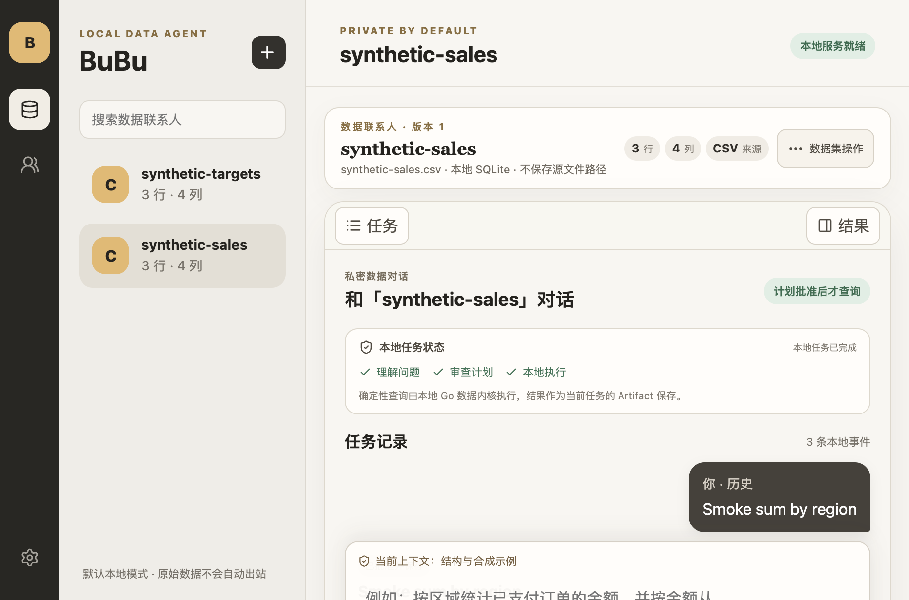
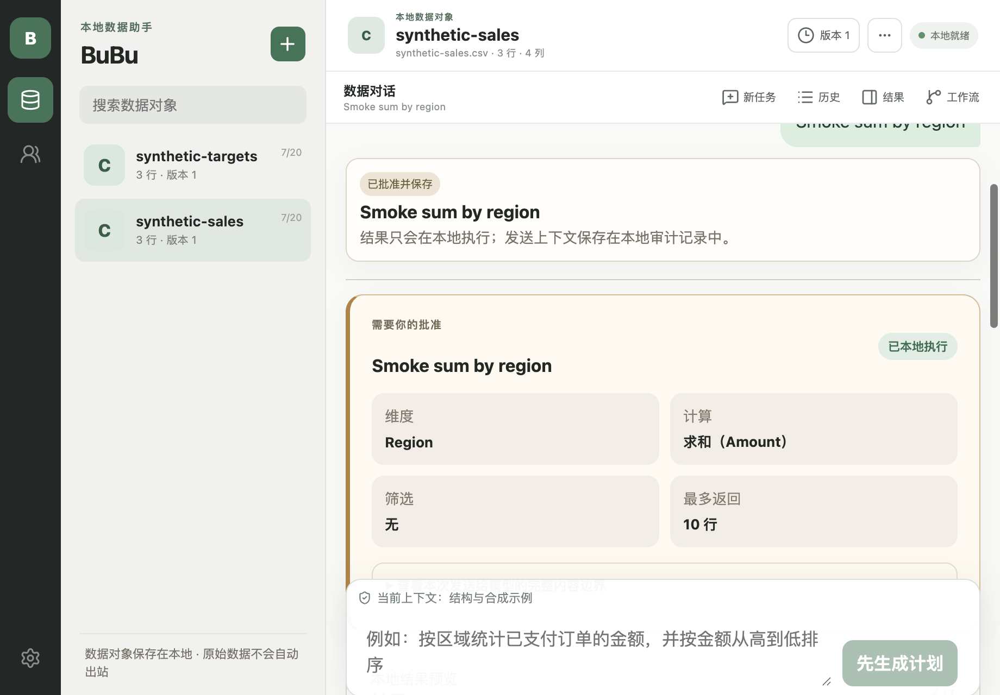
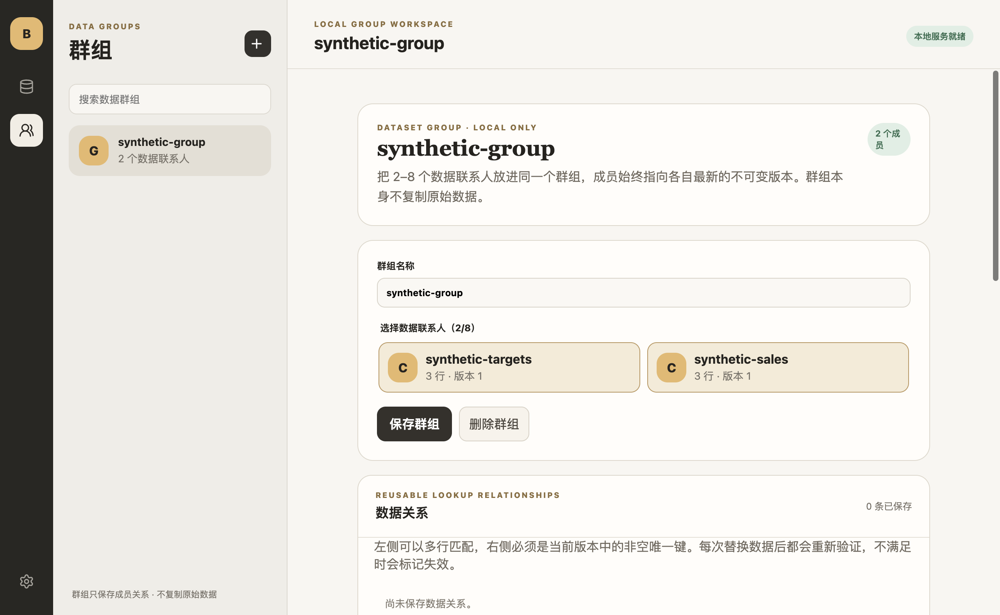
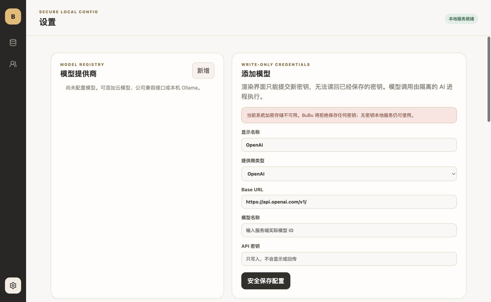

# Product and UI/UX constraints

Status: executable design contract for the current Electron product. Visual preference never overrides privacy, process, or capability truth.

## Product model

BuBu is a calm, conversation-first local data workspace, not a generic chat shell or a dense BI dashboard. A dataset is a data contact; a 2–8 member collection is a data group; a conversation thread is the durable local trail connecting a user question, visible disclosure, typed plan, bounded result, chart, workflow, and audit.

The primary journey is import → inspect → ask → review → approve → use a local result. The UI must preserve that causal chain. It must not hide the dataset/version being queried, make a model answer look like deterministic output, or collapse disclosure approval into a generic confirmation.

## Information architecture

- The narrow rail switches among datasets, groups, and settings with semantic Lucide icons, text alternatives, `aria-pressed`, and visible keyboard focus.
- Dataset and group contacts appear only where they are relevant. Within a dataset or group, a thread list makes the current task explicit; users can create, rename, resume, and archive independent local conversations without mixing their evidence. Settings uses the full workspace width and must not retain an unrelated contact list.
- The conversation workbench has three responsibilities: threads choose a task, the center carries the readable dialogue and sticky composer, and the right inspector carries durable artifacts or local data health. Results must not force the user to choose between reading the chat and inspecting evidence.
- A task status strip exposes the current causal step—understanding, review, local execution—without pretending that an in-progress model call has already produced a result. Automation belongs in the Artifact inspector, where a reviewed plan can be made repeatable without leaving the task context.
- The workspace header states the active entity and current product state. Primary actions belong near the object they affect; destructive actions require explicit language and confirmation.
- At the supported packaged smoke viewport of 920 × 640, every primary journey must remain readable without horizontal page overflow. Dense tables, schema, JSON, and audit content may scroll inside bounded regions.

## State and copy

Every capability is visibly one of implemented, disabled, or planned. Never render a working button for a planned capability or silently fall back from a failed sidecar/provider to a mock result.

Async operations need a clear start label, progress state, cancellation when supported, terminal outcome, and recovery action. Copy distinguishes:

- deterministic local computation from model output;
- local-only data from content approved for a remote provider;
- trusted BuBu policy from untrusted model/MCP text;
- cancelling a request from rolling back an external side effect;
- a saved configuration from a launched process.

## Privacy and approval UX

- Raw rows remain local by default. Remote disclosure reviews name the destination, exact disclosure class, row/cell bounds, and one-use nature before approval.
- Credentials are write-only in the renderer. Saved secrets are represented by presence or key name, never recovered plaintext.
- MCP save, inspect, resource read, prompt get, and tool call are different authorities. Saving never starts a server. Every invocation displays the canonical executable, ordered arguments, environment key names, exact target/input, expiry, and fixed limits.
- MCP metadata and results are labeled local-only and untrusted. There is no automatic “send to chat/model/Agent/workflow” action.
- Task-required MCP tools are disabled rather than presented as partially working. Tool annotations are orientation only, never safety proof.

## Interaction and accessibility

- Use the installed Lucide icon set; do not use emoji, ASCII, CSS drawings, or unlabeled symbols as UI assets.
- All interactive controls must be reachable by keyboard. `:focus-visible` uses a high-contrast accent outline without shifting layout.
- Icon-only controls require a visible tooltip/title and an accessible name. Toggle-like navigation exposes selection state.
- Labels remain programmatically associated with inputs. Status and errors use appropriate live/status or alert roles without moving focus unexpectedly.
- Inputs and buttons keep a usable target size and do not depend on color alone. Destructive buttons use verbs naming the object and require confirmation where recovery is impossible.

## Visual system

Build on the existing warm neutral surfaces, amber accent, restrained radii, thin borders, compact type scale, and generous whitespace. Avoid adding a competing dashboard palette or decorative hero treatment. Use the current components and tokens before inventing a variant. Product density should come from progressive disclosure (`details`, bounded tables, review panels), not smaller text or compressed controls.

## Current-run audit and resolved findings

Packaged synthetic screenshots are generated by `npm run capture:ui`; the harness imports two distinct synthetic files, creates a group, waits for preview/quality readiness, and never reads user data.

| Surface | Finding | Resolution | Evidence |
| --- | --- | --- | --- |
| Electron development renderer | Strict CSP blocked React Fast Refresh preamble and produced a blank window | Disable Vite HMR for the Electron renderer and lock it with a configuration test | packaged/dev build and test |
| Dataset composer | Privacy copy consumed horizontal flex space, compressing the question field into a narrow vertical strip | Use a three-column grid with a real `minmax(0, 1fr)` input column | `docs/assets/product/02-chat.png` |
| Conversation ownership | One target mapped to one ever-growing history, so unrelated analysis tasks competed for the same screen and audit trail | Persist independent per-target threads; present a task list, a continuous central timeline, and a separate artifact/data inspector | `docs/assets/product/01-datasets.png`, `docs/assets/product/02-chat.png` |
| Main navigation | Abstract text glyphs were ambiguous and inconsistent | Use semantic Lucide dataset/group/settings icons with accessible selected state | all product screenshots |
| Settings | Dataset contacts remained visible even though they had no settings role | Give settings a focused two-column rail/workspace layout | `docs/assets/product/03-settings.png` |
| Navigation between long views | Document-level scrolling retained an unrelated deep position when moving from a dataset to groups or settings | Constrain the shell to the viewport, keep scrolling inside the workspace, and reset that container on entity/view change | group and settings packaged screenshots |
| Keyboard navigation | Controls lacked a consistent visible focus treatment | Add a shared high-contrast `:focus-visible` outline | renderer stylesheet and packaged smoke |
| MCP tools | Discovered tools had schema display but no truthful manual execution journey | Add exact JSON entry, schema/task validation, second review, one-use approval, local result, audit, and task-required disabled state | contracts, desktop tests, MCP smoke |

## Review checklist

For UI changes, run unit/type gates, regenerate packaged synthetic screenshots, inspect every affected state at the same viewport, and verify the main actions and inputs—not only appearance. A screenshot proves the rendered state, not keyboard behavior, privacy policy, failure recovery, or process authority; those require executable tests and boundary verifiers.
