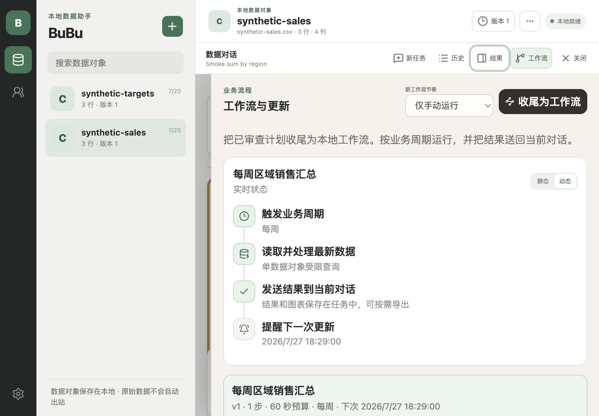

# Product and UI/UX constraints

Status: executable design contract for the current Electron product. Visual preference never overrides privacy, process, or capability truth.

## Product model

BuBu is a calm, conversation-first local data workspace, not a generic chat shell or a dense BI dashboard. Imported Excel/CSV files become locally named data objects; a 2–8 member collection is a business topic with a one-off or periodic rhythm; a conversation thread is the durable local trail connecting a user question, visible disclosure, typed plan, bounded result, chart, workflow, and audit.

The primary journey is import → inspect → ask → review → approve → use a local result. The UI must preserve that causal chain. It must not hide the dataset/version being queried, make a model answer look like deterministic output, or collapse disclosure approval into a generic confirmation.

## Information architecture

- The narrow rail switches among datasets, groups, and settings with semantic Lucide icons, text alternatives, `aria-pressed`, and visible keyboard focus.
- Dataset and group contacts appear only where they are relevant. Within a dataset or group, a thread list makes the current task explicit; users can create, rename, resume, and archive independent local conversations without mixing their evidence. Settings uses the full workspace width and must not retain an unrelated contact list.
- The conversation workbench keeps the center for readable dialogue and a bottom composer. New task, history, result, and workflow controls live in the top-right toolbar; history and inspectors open as bounded overlay drawers at every width so the chat is always primary. The same actions are available in a right-click context menu.
- Artifact may expand for data or automation work, but closing it must return to the current task. Its workflow view supports static definition and dynamic run state, with explicit trigger, data processing, conversation delivery, and reminder nodes.
- Dataset and group identity remain in a compact context bar. Export, replacement, deletion, and membership management are secondary object operations and must not visually outrank starting or continuing a task.
- A task status strip exposes the current causal step—understanding, review, local execution—without pretending that an in-progress model call has already produced a result. Automation belongs in the Artifact inspector, where a reviewed plan can be made repeatable without leaving the task context.
- Message form communicates authority: user input is a right-side bubble, assistant narrative is visually quiet, tool activity is a compact event row, approval is a unique card, failure is a recovery surface, and result data is a bounded preview. Full tables and evidence belong to Artifact instead of being repeated in the dialogue.
- The workspace header states the active entity and current product state. Primary actions belong near the object they affect; destructive actions require explicit language and confirmation.
- Result actions state their scope. “复制” and “导出当前视图” use the Artifact table after its current filter/sort; source-dataset export remains a separate dataset operation. Pinned state is local UI orientation, not a new data copy or audit claim.
- A chart is shown only when a pure suitability rule can explain it without inventing aggregation or hiding high cardinality. The UI always states the recommendation reason and supplies the exact plotted points as a table. Local HTML reports remain bounded, static, escaped, and free of hidden source rows.
- Settings begins with ordered, actionable findings rather than equal-weight status tiles. Blockers, required setup, and optional integrations have different language; each routes to a stable list–detail section, and the user can rerun diagnostics after a change.
- History/result/workflow panels move focus into the opened surface, close on Escape, and return focus to the invoking control. Artifact tabs support left/right arrow navigation. Packaged smoke validates these journeys at the minimum viewport instead of treating screenshots as interaction proof.
- Local product metrics may contain only whitelisted event names, target kind, outcome, bounded duration, and row/column counts. They never contain task IDs, questions, prompts, outputs, paths, credentials, or data values and never leave the local workspace.
- At the supported packaged smoke viewport of 920 × 640, every primary journey must remain readable without horizontal page overflow. Dense tables, schema, JSON, and audit content may scroll inside bounded regions.

## State and copy

Every capability is visibly one of implemented, disabled, or planned. Never render a working button for a planned capability or silently fall back from a failed sidecar/provider to a mock result.

Async operations need a clear start label, progress state, cancellation when supported, terminal outcome, and recovery action. Copy distinguishes:

- deterministic local computation from model output;
- local-only data from content approved for a remote provider;
- trusted BuBu policy from untrusted model/MCP text;
- cancelling a request from rolling back an external side effect;
- a saved configuration from a launched process.

Conversation task state is a typed product lifecycle rather than component-specific strings. Persisted history is authoritative after restart: a plan awaits approval, a result is complete, an error needs attention, a cancellation is explicitly labelled, and an unmatched saved question is recoverable as an interrupted run.

## Privacy and approval UX

- Raw rows remain local by default. Remote disclosure reviews name the destination, exact disclosure class, row/cell bounds, and one-use nature before approval.
- Credentials are write-only in the renderer. Saved secrets are represented by presence or key name, never recovered plaintext.
- MCP save, inspect, resource read, prompt get, and tool call are different authorities. Saving never starts a server. Every invocation displays the canonical executable, ordered arguments, environment key names, exact target/input, expiry, and fixed limits.
- MCP metadata and results are labeled local-only and untrusted. There is no automatic “send to chat/model/Agent/workflow” action.
- Task-required MCP tools are disabled rather than presented as partially working. Tool annotations are orientation only, never safety proof.

## Interaction and accessibility

- Use the installed Lucide icon set; do not use emoji, ASCII, CSS drawings, or unlabeled symbols as UI assets.
- All interactive controls must be reachable by keyboard. `:focus-visible` uses a high-contrast accent outline without shifting layout.
- Icon-only controls require a visible tooltip/title and an accessible name. Toggle-like navigation exposes selection state.
- Labels remain programmatically associated with inputs. Status and errors use appropriate live/status or alert roles without moving focus unexpectedly.
- Inputs and buttons keep a usable target size and do not depend on color alone. Destructive buttons use verbs naming the object and require confirmation where recovery is impossible.

## Visual system

Build on the graphite rail, warm-white canvas, muted green trust/action accent, restrained radii, thin borders, compact type scale, and generous whitespace. The density follows WeChat-style navigation efficiency and Codex-style calm without cloning either product. Avoid decorative hero treatments. Product density should come from progressive disclosure (`details`, drawers, bounded tables, review panels), not smaller text or compressed controls.

## Current-run audit and resolved findings

Packaged synthetic screenshots are generated by `npm run capture:ui`; the harness imports two distinct synthetic files, creates a group, waits for preview/quality readiness, and never reads user data.

| Surface | Finding | Resolution | Evidence |
| --- | --- | --- | --- |
| Electron development renderer | Strict CSP blocked React Fast Refresh preamble and produced a blank window | Disable Vite HMR for the Electron renderer and lock it with a configuration test | packaged/dev build and test |
| Dataset composer | Privacy copy consumed horizontal flex space, compressing the question field into a narrow vertical strip | Use a three-column grid with a real `minmax(0, 1fr)` input column | `docs/assets/product/02-chat.png` |
| Conversation ownership | One target mapped to one ever-growing history, so unrelated analysis tasks competed for the same screen and audit trail | Persist independent per-target threads; present a task list, a continuous central timeline, and a separate artifact/data inspector | `docs/assets/product/01-datasets.png`, `docs/assets/product/02-chat.png` |
| Main navigation | Abstract text glyphs were ambiguous and inconsistent | Use semantic Lucide dataset/group/settings icons with accessible selected state | all product screenshots |
| Settings | Dataset contacts remained visible even though they had no settings role | Give settings a focused two-column rail/workspace layout | `docs/assets/product/03-settings.png` |
| Navigation between long views | Document-level scrolling retained an unrelated deep position when moving from a dataset to groups or settings | Constrain the shell to the viewport, keep scrolling inside the workspace, and reset that container on entity/view change | group and settings packaged screenshots |
| Keyboard navigation | Controls lacked a consistent visible focus treatment | Add a shared high-contrast `:focus-visible` outline | renderer stylesheet and packaged smoke |
| MCP tools | Discovered tools had schema display but no truthful manual execution journey | Add exact JSON entry, schema/task validation, second review, one-use approval, local result, audit, and task-required disabled state | contracts, desktop tests, MCP smoke |
| Conversation hierarchy | Dataset preview and management cards pushed chat below the first viewport | Keep only a compact entity summary above the workbench; move preview and quality into the data-context inspector | current packaged screenshots |
| Workflow ownership | Target-only delivery could append an automated result to a different thread | Persist `threadId`, validate the source plan in that thread, migrate old definitions, and deliver only to the bound active thread | Go regression tests and product verifier |
| Compact workbench | Four horizontal surfaces overflowed the supported minimum width | Preserve the center chat and expose task/result drawers with keyboard state and reduced-motion handling | packaged smoke and `verify:product-experience` |
| Chat message hierarchy | Plans, progress, results, errors, and narration all looked like interchangeable cards, while large result tables duplicated Artifact | Give every message authority a stable visual grammar and limit dialogue results to five-row previews | `ChatMessage.tsx`, packaged screenshots, and product verifier |
| Compact result readability | The supporting result drawer reserved 250 px for chat, leaving charts and long result labels visibly clipped at the minimum viewport; screenshot capture also froze the closing transition and made the panel appear broken | Use a 520 px capped overlay sheet with a 48 px orientation edge, retain backdrop/Escape/focus return, capture only settled states, and keep the full-width drawer below 430 px | current `04-artifact.png`, packaged smoke, and product verifier |
| Decorative hierarchy | English all-caps kickers competed with Chinese task labels and made settings/results feel like a template rather than one coherent product | Keep technical names such as MCP/AI where meaningful, but express navigation, trust, result, and settings hierarchy in concise Chinese | current product screenshots and product verifier |
| Data object identity | Imported files were presented only by source filename and version history occupied management space | Ask for a local business name after import; keep original filename for audit; expose immutable versions from the object header and right-click menu | contracts, Go regression test, packaged dataset journey |
| Business topics | Groups had membership but no business meaning or temporal product model | Persist a description and one-off/daily/weekly/monthly/data-update cadence, and use that cadence as the default workflow trigger | group contract tests and group screenshot |
| Chat workspace controls | Task/result navigation competed with the conversation and workflow was buried inside Artifact | Keep new task, history, result, and workflow in the top-right toolbar and mirror them in a context menu | packaged drawer smoke and `verify:product-experience` |
| Workflow comprehension | Saved automation was a list with no processing or delivery model | Render the typed definition as a static/dynamic node graph with latest persisted run state, conversation delivery, and next-update reminder | `docs/assets/product/05-workflow.png` and workflow smoke |

## Review checklist

For UI changes, run unit/type gates, regenerate packaged synthetic screenshots, inspect every affected state at the same viewport, and verify the main actions and inputs—not only appearance. A screenshot proves the rendered state, not keyboard behavior, privacy policy, failure recovery, or process authority; those require executable tests and boundary verifiers.
